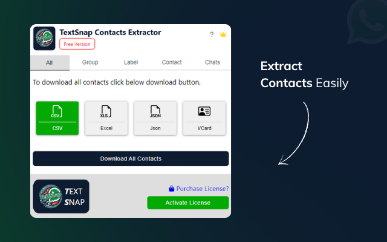
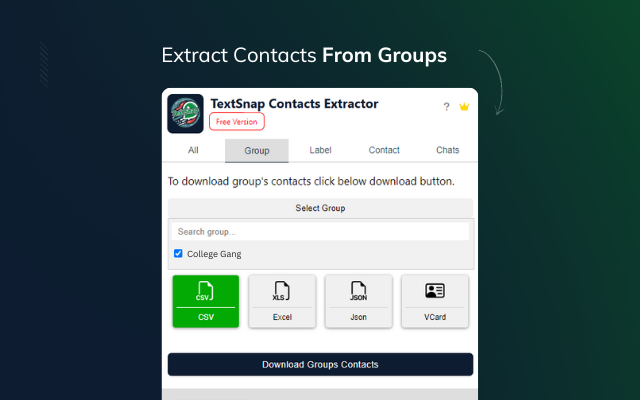
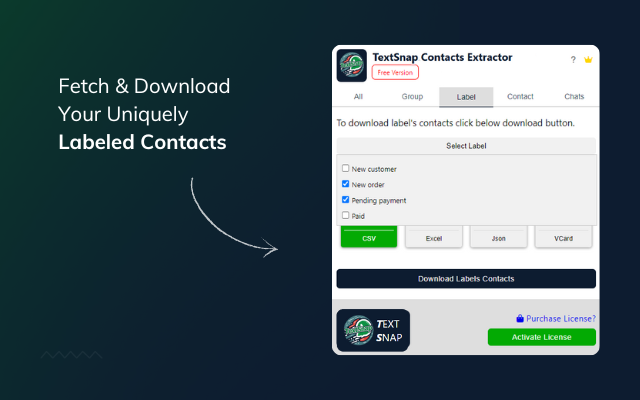
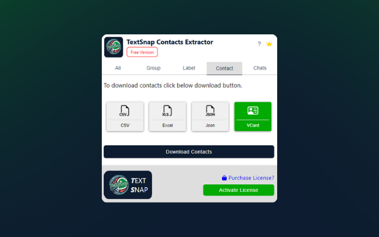
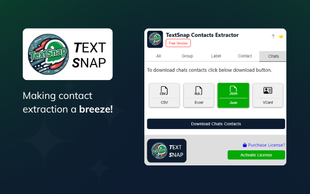

  

  <b>The ultimate Chrome extension to extract and export your WhatsApp Web contacts effortlessly — fast, secure, and 100% local.</b>

<h1 align="center">TextSnap Contacts Extractor</h1>

  <b>Extract WhatsApp Contacts Instantly — From Chats, Groups, and Labels!</b> 
  Version 1.0.1 • Developed by <a href="https://textsnap.in">TextSnap</a>

---

## 🧩 Overview

**TextSnap Contacts Extractor** is a Chrome Extension that helps you extract all your WhatsApp contacts directly from **WhatsApp Web**.  
With just a single click, you can export contacts from **All Contacts**, **Groups**, **Labels**, **Chats**, or **Individual Contacts** into your preferred format.

---

## ⬇️ Download Extension

Get the latest version of **TextSnap Contacts Extractor** from either the **Chrome Web Store** or **GitHub Releases**.

  <!-- Chrome Web Store Button -->
  
  &nbsp;&nbsp;
  <!-- GitHub Download Button -->
  

### 🧭 Manual Installation Steps
1. Download the `.crx` file from the GitHub link above *(or install directly from Chrome Web Store)*.  
2. Open `chrome://extensions/` in your Chrome browser.  
3. Enable **Developer Mode** (top right corner).  
4. Drag and drop the `.crx` file onto the page.  
5. The extension will install automatically. ✅

---

## ⚙️ Features

✅ Extract contacts from:
- **All Contacts**
- **Groups**
- **Labels**
- **Individual Chats**
- **Contacts List**

✅ Export in multiple formats:
- **CSV**
- **Excel (XLS)**
- **JSON**
- **vCard**

✅ Other highlights:
- Works seamlessly with [WhatsApp Web](https://web.whatsapp.com/)
- Clean and intuitive interface
- Fast contact extraction
- No external data storage — everything happens locally in your browser

---

## 🖼️ Screenshots

### 🟢 All Contacts

---

### 🟣 Group Contacts

---

### 🟡 Label Contacts

---

### 🔵 Contact Page

---

### 🟠 Chats Contacts

---

## 🚀 How It Works

1. Open **[WhatsApp Web](https://web.whatsapp.com/)** in your browser.  
2. Click the **TextSnap Contacts Extractor** icon in the Chrome toolbar.  
3. Choose the section you want to extract (All, Group, Label, Contact, or Chats).  
4. Click **Download Contacts** to export them in your desired format (CSV, Excel, JSON, or vCard).  
5. Done — your contacts are ready!

---

## 🔒 Privacy & Security

- The extension runs **entirely locally** in your browser.  
- No contact or message data is ever sent to external servers.  
- Only anonymous analytics are collected via [Aptabase](https://aptabase.com/) to improve performance.

Read our full [Privacy Policy](https://github.com/AmitDas4321/TextSnap-Contacts-Extractor/blob/main/PRIVACY.md).

---

## 🧰 Permissions Used

| Permission | Purpose |
|-------------|----------|
| `activeTab` | Accesses the current WhatsApp Web tab to read visible contact data. |
| `storage` | Saves extracted contacts and user preferences locally. |

Host permission:  
`https://web.whatsapp.com/*` – required to extract contact data from WhatsApp Web.

---

## 💬 Support

If you face any issues or have feedback, contact us at  
📧 [support@textsnap.in](mailto:support@textsnap.in)

---

## 📜 License

This extension is © 2025 **TextSnap**.  
All rights reserved. Unauthorized distribution or resale is strictly prohibited.

---

  <b>Made with ❤️ by <a href="https://amitdas.site">Amit Das</a></b>

